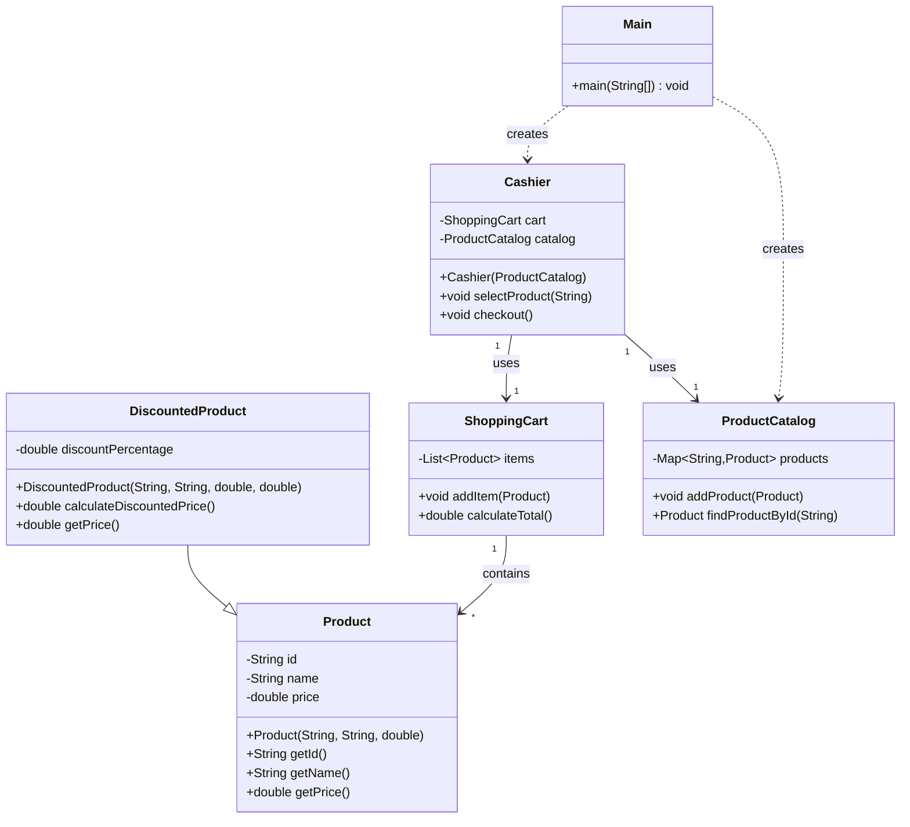

# Simple Cashier System

A basic Java implementation of a cashier system that demonstrates Object-Oriented Programming concepts.

## Project Overview

This project simulates a simple cashier system where you can:
- Add products to a shopping cart
- Handle regular and discounted products
- Calculate the total price of items

## Class Structure

- `Product`: Base class for all products with basic properties (id, name, price)
- `DiscountedProduct`: Extends Product to handle items with discounts
- `ShoppingCart`: Manages the collection of products selected by customers
- `Cashier`: Handles the checkout process
- `ProductCatalog`: Stores and manages available products

## How to Use

1. Run the `Main` class
2. You'll see a list of available products with their IDs:
   - P001 - Milk ($2.99)
   - P002 - Bread ($1.99)
   - P003 - Soda ($1.50 with 10% discount)
   - P004 - Eggs ($3.49)

3. Enter product IDs one at a time
4. Press Enter without typing anything to finish selection
5. The system will display the total amount

## Project Structure
```
src/
├── cashier/
│   ├── Main.java
│   ├── Cashier.java
│   ├── cart/
│   │   └── ShoppingCart.java
│   └── product/
│       ├── Product.java
│       ├── DiscountedProduct.java
│       └── ProductCatalog.java
```

## Class Relations and Design

### Class Hierarchy and Relationships
- `Product` is the parent class for all products
  - `DiscountedProduct` inherits from `Product` to add discount functionality
- `ShoppingCart` has a one-to-many relationship with `Product` (contains multiple products)
- `Cashier` has a one-to-one relationship with `ShoppingCart` (uses one cart)
- `ProductCatalog` maintains a collection of all available products

### Class Details

1. **Product Class**
   - Properties: id, name, price
   - Methods:
     - `getPrice()`: Returns product price
     - `getId()`: Returns product ID
     - `getName()`: Returns product name

2. **DiscountedProduct Class**
   - Inherits from Product
   - Additional property: discountPercentage
   - Methods:
     - `calculateDiscountedPrice()`: Calculates price after discount
     - Overrides `getPrice()` to return discounted price

3. **ShoppingCart Class**
   - Contains List<Product> for storing items
   - Methods:
     - `addItem()`: Adds a product to cart
     - `calculateTotal()`: Sums up prices of all items

4. **Cashier Class**
   - Contains ShoppingCart and ProductCatalog instances
   - Methods:
     - `selectProduct()`: Adds product to cart by ID
     - `checkout()`: Calculates and displays final total

5. **ProductCatalog Class**
   - Stores available products in a HashMap
   - Methods:
     - `addProduct()`: Adds new product to catalog
     - `findProductById()`: Retrieves product using ID

### Class Diagram

----
> Main Class Relations (Optional)

