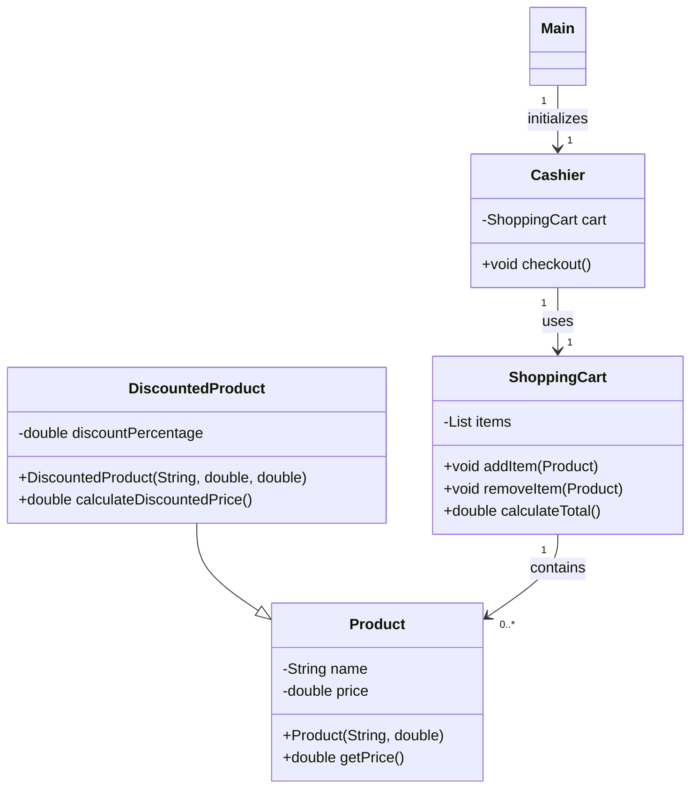

```mermaid
classDiagram
    class Product {
        -String name
        -double price
        +Product(String, double)
        +double getPrice()
    }

    class DiscountedProduct {
        -double discountPercentage
        +DiscountedProduct(String, double, double)
        +double calculateDiscountedPrice()
    }

    class ShoppingCart {
        -List<Product> items
        +void addItem(Product)
        +void removeItem(Product)
        +double calculateTotal()
    }

    class Cashier {
        -ShoppingCart cart
        +void checkout()
    }

    DiscountedProduct --|> Product
    ShoppingCart "1" --> "0..*" Product : contains
    Cashier "1" --> "1" ShoppingCart : uses
    Main "1" --> "1" Cashier : initializes
```