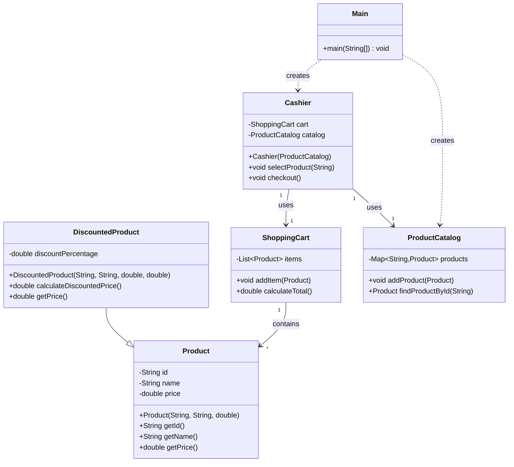

```mermaid
classDiagram
    class Product {
        -String id
        -String name
        -double price
        +Product(String, String, double)
        +String getId()
        +String getName()
        +double getPrice()
    }

    class DiscountedProduct {
        -double discountPercentage
        +DiscountedProduct(String, String, double, double)
        +double calculateDiscountedPrice()
        +double getPrice()
    }

    class ShoppingCart {
        -List~Product~ items
        +void addItem(Product)
        +double calculateTotal()
    }

    class Cashier {
        -ShoppingCart cart
        -ProductCatalog catalog
        +Cashier(ProductCatalog)
        +void selectProduct(String)
        +void checkout()
    }

    class ProductCatalog {
        -Map~String,Product~ products
        +void addProduct(Product)
        +Product findProductById(String)
    }

    class Main {
        +main(String[]) void
    }

    DiscountedProduct --|> Product
    ShoppingCart "1" --> "*" Product : contains
    Cashier "1" --> "1" ShoppingCart : uses
    Cashier "1" --> "1" ProductCatalog : uses
    Main ..> Cashier : creates
    Main ..> ProductCatalog : creates
```